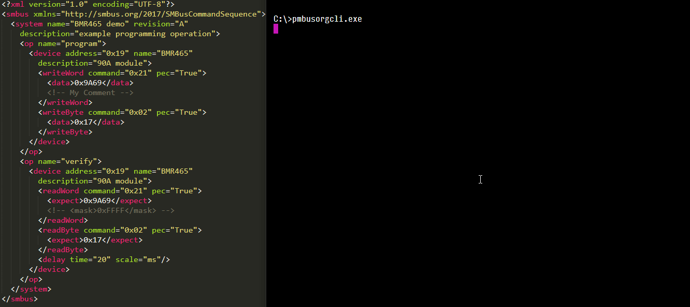

PMBusOrg CLI
-----------------

# Note: Prototype Software (and call for interest)
This software is currently in 'working prototype' status. It is expected that the xml-style format will change to something else. As of Fall 2019 discussions on the direction of this work is being discussed in the PMBus Working Group meetings. If interested, consider joining [PMBus.org](http://www.pmbus.org)

# Introduction

The PMBus.org Command Line Interface performs pmbus transactions as specified in a standardized PMBus configuration format. Typically this would be used during a time of production to configure (or verify configuration) of . Things are designed generically enough that one could use this as a generic I2C/SMBus scripting tool.

# Running PMBusOrgCLI

You'll want to start by writing an xml configuration file. The pmbusorgcli is centered around using a standardized configuration file format, which [will be detailed in a separate document.](TODO).

To run a file, you may start by listing out the available operations with `-l`
`pmbusorgcli.exe myFile.xml -l`

Then find a system/operation pair in the file to execute as a dry run
`pmbusorgcli.exe myFile.xml -s mySystem -o myOperation --dry-run --verbose` 

Finally when ready, specify the interface (e.g. TotalPhase Aardvark USB-I2C) you want to use and run.
`pmbusorgcli.exe myFile.xml -s mySystem -o myOperation -i aardvark --verbose` 

# Build Instructions (windows)

These instructions assume a bare windows installation that doesn't yet have python or any develpoment tools.

## Package manager & git installation
Open a command shell in administrator mode (I use Hyper, which conveniently bundles a `refreshenv` command which helps after adding environment variables)

0. Within the command shell install chocolatey, a package manager for windows.
Follow instructions at https://chocolatey.org/install

0. Install git - `choco install git`

## Environment setup - installing python

0. `choco install python --version 3.6.6` - we're installing Python 3.6.6 because at the time of writing (July 2018) Python 3.7 was too new such that precompiled 'wheel' packages for some dependencies (lxml) were not available on windows yet. 

0. `python -m pip install --upgrade pip setuptools wheel` - this'll just make sure the pip and wheel packages are up to date.

## Environment setup - interfaces - Total Phase Aardvark

0. If using PMBusOrgCLI with a Total Phase Aardvark, make sure you've already installed the latest windows usb drivers from https://www.totalphase.com/products/usb-drivers-windows

## Building PMbusOrgCLI

0. `cd` into a suitable working directory, then clone this repository `git clone git://github.com/PMBusOrg/PMBusOrgCLI`

0. `cd PMBusOrgCLI` - go to where you cloned the repository.

0. `pip install -r requirements.txt` - install dependencies.

0. `pyinstaller pmbusorgcli_pyinstaller_main.spec` - build the executable.

0. Now in the `dist` folder there will be pmbusorgcli.exe (or the equivalent executable type on macos/linux).

## Running tests

TODO.

## Running within python

TODO

